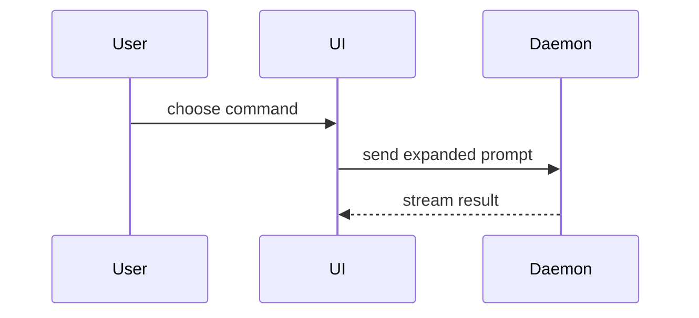

# 写 PR 描述

为当前分支创建或更新 PR，描述要让 reviewer 明白这个改动为什么存在、实现长什么样、现有用户会失去什么。

## 工作流

1. 读 PR 模板：

   `Read(.github/pull_request_template.md)`

2. 找到或创建 PR：
   - 先查当前分支有没有 PR：`gh pr view --json url,number,title,state 2>/dev/null`。
   - 没有的话，看 `git status --short --branch` 和当前分支上的提交。
   - 提交剩余改动，带 upstream 推送分支，用 `gh pr create` 创建 PR。
   - 遵守仓库的 git 安全规范。

3. 收集解释改动所需的上下文：
   - 读关联的 issue 和相关任务产物。
   - 读完整 diff（`git diff main...HEAD`）和足够的周边代码，理解行为与归属。
   - PR 已存在时，用 `gh pr view` 拿元数据和改动文件列表。

4. 按模板各节写描述。描述用用户当前使用的语言，行为变化表也一样；只有三样固定：PR 标题保持英文 Conventional Commit，changeset 保持英文（见 `gen-changesets` skill），节标题沿用模板原文。
   - **Requirement or Bug**：一句话，或 `Resolve #<number>`。不要多写。
   - **Bug Reproduction Steps**：只有 bug 类 PR 需要；feature 写 `N/A`。步骤已在 issue 里的写 `See linked issue`。
   - **Root Cause**：只有 bug 类 PR 需要；feature 写 `N/A`。说明根因，以及这是根本修复还是绕过。
   - **Code Changes**：能用可视化大纲说清楚的就不要写散文，见"代码变更的可视化大纲"。
   - **Behavior Changes and Affected Users**：先填行为变化表，再列受影响模块与测试覆盖，见"行为变化与受影响人群"。
   - **Checklist**：勾上所有适用的项。

5. 发布描述：
   - 先存到临时文件，再 `gh pr edit <number> --body-file <path>` 或 `gh pr create --body-file <path>`。
   - 确认更新成功。

## 行为变化与受影响人群

这一节回答一个问题：合入之后，现有用户会失去什么。这个仓库过去的回归大多来自没人回答这个问题，而不是逻辑错误。

判据：**改动前能工作的任何输入（配置键、环境变量、命令行参数、provider 响应形态、旧版本写的会话数据、客户端请求、hook 载荷）改动后必须行为不变，除非这里明确声明了变化并给出退路。**

写法：

1. 列出 diff 改变的每一个可观测行为，一行一个。包括你认为"不变"但分支条件挪动了的：新增的条件会不会先于旧条件命中既有输入；删除或收窄的分支改动前谁在走。内部包会打进 CLI 发布包，"内部"不等于用户无感。表格用 PR 描述的语言，下面的示例用英文只是示意形状：

   | Behavior | Before | After | Who relies on the old behavior | Escape hatch |
   |---|---|---|---|---|
   | reasoning parsing when `reasoning_details` is an array | string `reasoning` also read | string ignored | OpenAI-compatible gateways that send both (OpenRouter dialect) | none |

2. 人群要具名，不要写"部分用户"。从 `.agents/skills/review-pr/surfaces.md` 里取：客户端（TUI、print 模式、desktop 与 web、VS Code、ACP、SDK）、provider 方言、平台、配置状态、数据年代、外部脚本。

3. 改了 prompt 文本（system prompt、工具描述、提醒）的，每一句单独成行，写清这句改动前约束了什么行为、谁依赖、现在由什么来约束。"没有测试引用这句"不是无影响的证据。

4. 替换或绕过旧路径的（移植、runtime binding、协议替换），额外列出旧路径的功能清单：它认哪些环境变量、有哪些兜底、接受哪些输入，以及每一项在新路径里的位置。

5. 确实没有可观测变化的，写 `None`，并说明证据：哪些分支、默认值、契约文件没动。

6. 表后面列受影响模块与每一行对应的测试覆盖。默认翻转或删除行为的，必须有一条测试把未被改动的人群的旧行为钉住，并且 changeset 要写明用户失去了什么，见 `gen-changesets` skill。

## 代码变更的可视化大纲

优先用结构化视图，少用散文。用能说清实现的最小组合，没变的类别不要列。

逻辑或算法变化用伪代码 diff：

```diff
 on(save)
-  write content
+  if content is unchanged
+    return cached result
+  write new content
+  invalidate cache
```

运行时控制流用调用树 diff：

```diff
 submitForm
   createSession
     persistPrompt
+    expandSkillMention
     launchAgent
-  navigateToSession
+  navigateToSession
+    subscribeToEvents
```

文件职责变化用浅层文件树 diff：

```diff
 src/
 ├── commands/
+│   └── show-me.ts       # expands the slash command
 ├── sessions/
-└── transport.ts
+└── transport/
+    ├── client.ts
+    └── stream.ts
```

组件或 UI 结构变化用树 diff：

```diff
 <SessionPage>
   useSessionEvents()
   <SessionToolbar>
+    <RunSkillButton />
   <SessionTimeline>
+    <SkillResultCard />
```

组件交互、控制流或数据流用 Mermaid，解释 bug 机制时尤其有用：



关键数据结构或类型变化用对应语言的代码块：

```ts
interface SessionEvents {
  onTurnStart(cb: (turn: Turn) => void): void;
  onTurnEnd(cb: (turn: Turn) => void): void;
}
```

可视化大纲的规则：
- 重点是"变了什么"且周边形状已存在时，用 `diff` 块。
- 大部分是新内容，或 diff 记法会掩盖归属和顺序时，用对应语言或 `text` 块给出完整目标形状。
- 按最容易理解的顺序讲：先文件还是先数据结构，哪个合适用哪个。
- 像一个人对另一个人讲话：简单、连贯、简洁。
