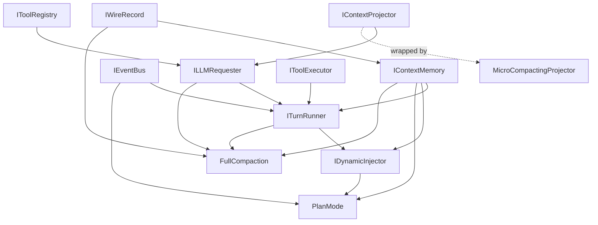

# Agent core extensibility design

## Service dependency graph

> Dependencies are for the default implementations. Arrows point from a service
> to the service that depends on it.



## Service interfaces

```ts
interface IContextMemory {
  getHistory(): readonly ContextMessage[]
  spliceHistory(start: number, deleteCount: number, ...messages: ContextMessage[]): void
  hooks: Hooks<{
    onSpliced: { start: number; deleteCount: number; messages: ContextMessage[] }
  }>
}

interface IContextProjector {
  project(messages: readonly ContextMessage[]): readonly Message[]
}

interface ILLMRequester {
  request(overrides?: LLMRequestOverrides, signal?: AbortSignal): AsyncIterable<LLMEvent>
}

interface ITurnRunner {
  launch(): Turn
  getActiveTurn(): Turn | undefined

  hooks: Hooks<{
    onLaunched: { turn: Turn }
    beforeStep: { ... }
    afterStep: { ... }
  }>
}

interface Turn {
  id: string
  abortController: AbortController
  ready: Promise<void>
  result: Promise<TurnResult>
}

interface IToolRegistry {
  register(tool: Tool): void
  unregister(name: string): boolean
  list(): readonly ToolDefinition[]
  resolve(name: string): Tool | undefined

  hooks: Hooks<{
    onRegistered: { tool: Tool }
    onUnregistered: { tool: Tool }
  }>
}

interface IToolExecutor {
  execute(call: ToolCall): Promise<ToolResult>
}

interface IEventBus {
  emit(event: AgentEvent): void
  on(handler: (event: AgentEvent) => void): IDisposable
}

interface IWireRecord {
  append(record: WireRecord): void
  register<T extends WireRecord['type']>(
    type: T,
    resumer: (data: Extract<WireRecord, { type: T }>) => void,
  ): IDisposable

  hooks: Hooks<{
    onResumeEnded: {}
  }>
}

interface IDynamicInjector {
  register(
    injector: (state: { injectedAt: number | null }) =>
      string | undefined | Promise<string | undefined>,
  ): IDisposable
}
```

## Hook system

Each component owns its own hooks. There is no global hook manager. A component
knows which hooks it can emit, when they run, and what their context means.

Components expose hooks with this shape:

```ts
type Hooks<TEvents extends Record<string, unknown>> = {
  readonly [K in keyof TEvents]: HookSlot<TEvents[K]>
}

interface HookSlot<TContext> {
  register(
    id: string,
    handler: HookHandler<TContext>,
    options?: HookRegisterOptions,
  ): void

  delete(id: string): boolean
}

type HookHandler<TContext> = (
  context: TContext,
  next: () => Promise<void>,
) => void | Promise<void>

interface HookRegisterOptions {
  before?: string
  after?: string
}
```

Each hook slot is an ordered middleware chain. `id` is unique within one slot;
registering an existing `id` replaces that handler. `before` and `after` place
the handler relative to another existing `id`; missing targets fail.

```ts
await hooks.someHook.run(context, async () => {
  await terminalOperation()
})
```

`run` is internal; consumers only use `register(...)` and `delete(...)`.
Handlers can call `next()`, run before/after `next()`, mutate `context`, throw,
or skip `next()` to suppress the rest of the chain. Hook context should contain
only invocation-specific data. Ordering between different hook slots is defined
by the component, not by the hook system.

## Extension examples

### Plan mode

```ts
class PlanMode extends Disposable {
  private _active = false

  constructor(
    @IContextMemory private readonly context: IContextMemory,
    @IWireRecord private readonly wireRecord: IWireRecord,
    @IEventBus private readonly events: IEventBus,
    @IToolRegistry toolRegistry: IToolRegistry,
    @IDynamicInjector dynamicInjector: IDynamicInjector,
  ) {
    super()

    wireRecord.register('plan_mode_change', ({ isActive }) => {
      this._active = isActive
    })

    toolRegistry.register(EnterPlanModeTool);
    toolRegistry.register(ExitPlanModeTool);

    let wasActive = false
    this._register(dynamicInjector.register(({ injectedAt }) => {
      // Depends on active/wasActive, injectedAt and current plan content
    }))
  }

  get active() {
    return this._active
  }

  set active(value: boolean) {
    if (this._active === value) {
      return
    }

    this.wireRecord.append({ type: 'plan_mode_change', isActive: value })
    this._active = value
    this.events.emit({ type: 'plan_mode.changed', isActive: value })
  }
}
```

### Full compaction

```ts
class FullCompaction {
  constructor(
    @IContextMemory private readonly context: IContextMemory,
    @IContextProjector private readonly projector: IContextProjector,
    @ILLMRequester private readonly llmRequester: ILLMRequester,
    @ITurnRunner private readonly turnRunner: ITurnRunner,
  ) {
    this.turnRunner.hooks.beforeStep.register(
      'full-compaction',
      async (_ctx, next) => {
        if (shouldCompact(this.context.getHistory())) {
          await this.compact({ source: 'auto' })
        }

        await next()
      },
    )
  }

  async compact(input: CompactInput): Promise<void> {
    const history = this.context.getHistory()
    const compactedCount = strategy.computeCompactCount(history, input.source)
    const sourceMessages = history.slice(0, compactedCount)
    const messages = [
      ...this.projector.project(sourceMessages),
      createUserMessage(renderPrompt(compactionInstructionTemplate, {
        customInstruction: input.customInstruction,
      })),
    ]

    const response = collectMessages(await this.llmRequester.request(
      { messages },
      input.signal,
    ))
    const summary = extractCompactionSummary(response)

    if (!historyUnchanged(this.context.getHistory(), history)) {
      return
    }

    this.context.spliceHistory(
      0,
      compactedCount,
      {
        role: 'assistant',
        content: [{ type: 'text', text: summary }],
        toolCalls: [],
        origin: { kind: 'compaction_summary' },
      },
    )
  }
}
```

### Micro compaction

```ts
class MicroCompactingProjector implements IContextProjector {
  constructor(private readonly previous: IContextProjector) {}

  project(messages: readonly ContextMessage[]): readonly Message[] {
    const projected = this.previous.project(messages)
    return microCompact(projected)
  }
}
```

This keeps raw history intact and changes only what an LLM request sees.

## 插件自定义的层级

Level 1: configuration
  改参数，不改逻辑。

Level 2: hooks
  观察事件，更新外部状态，轻量注入。

Level 3: DI decorator / middleware
  包住一个已命名动作，支持 skip/retry/replace/wrap。

Level 4: service replacement
  替换整个组件实现。

Level 5: source-level extension / fork
  任意修改，但不保证兼容。  
